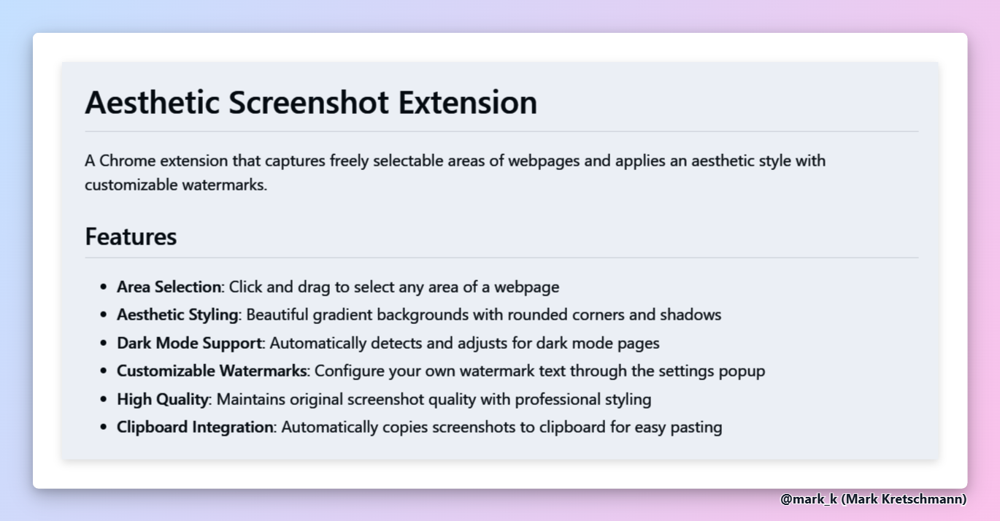

# Aesthetic Screenshot Extension

A Chrome extension that captures freely selectable areas of webpages and applies an aesthetic style with customizable watermarks.

## Features

- **Area Selection**: Click and drag to select any area of a webpage
- **Aesthetic Styling**: Beautiful gradient backgrounds with rounded corners and shadows
- **Dark Mode Support**: Automatically detects and adjusts for dark mode pages
- **Customizable Watermarks**: Configure your own watermark text through the settings popup
- **High Quality**: Maintains original screenshot quality with professional styling
 - **Crisp Typography**: Captures at 2× device scale without downscaling; applies a temporary system UI font stack and light color scheme for optimal text contrast and hinting
- **Clipboard Integration**: Automatically copies screenshots to clipboard for easy pasting

## Installation

1. Download or clone this repository
2. Open Chrome and go to `chrome://extensions/`
3. Enable "Developer mode" in the top right
4. Click "Load unpacked" and select the extension folder
5. The extension icon will appear in your toolbar

## Usage

### Taking Screenshots

1. **Click the extension icon** in your toolbar to open the settings popup
2. **Click "Take Screenshot"** to start area selection
3. **Click and drag** to select the area you want to capture
4. The screenshot will be automatically processed, copied to clipboard, and downloaded
5. Press `Esc` to cancel at any time

### Configuring Watermarks

**First Time Setup:**
1. **Click the extension icon** to open the settings popup
2. **Enter your watermark text** in the input field
3. **Preview** how it will look in real-time
4. **Save** your settings

**Later Access:**
- **Click the extension icon** anytime to access settings
- **Right-click** the extension icon and select "Settings & Options"
- Or access through the context menu anytime

#### Watermark Options

- **Custom Text**: Enter any text you want (e.g., "@username", "Company Name", "© 2024")
- **No Watermark**: Leave the field empty to disable watermarks entirely

### Quick Access

- **Right-click** the extension icon for quick access to settings
- **Context menu** option: "Settings & Options"

## Example

Example screenshot generated by the tool:



## Technical Details

- **Manifest Version**: 3 (latest Chrome extension standard)
- **Storage**: Uses Chrome's sync storage for cross-device settings
- **Permissions**: Minimal required permissions for functionality
- **Compatibility**: Works with all modern Chrome-based browsers

### Rendering Quality Notes

- Uses Chrome DevTools Emulation to capture at up to 2× device scale while keeping layout stable.
- Preserves the native hi‑res bitmap in the final PNG (no downscale), which keeps text edges sharp.
- Temporarily enforces a system UI font stack and light color scheme during capture to improve hinting and contrast, then reverts the page.

## File Structure

```
screenshot-extension/
├── manifest.json      # Extension configuration
├── background.js      # Service worker for screenshot processing
├── content.js         # Content script for area selection
├── popup.html         # Settings UI
├── popup.js           # Settings logic
└── README.md          # This file
```

## Customization

The extension automatically applies:
- Gradient backgrounds (blue to pink)
- Rounded corners with shadows
- Professional padding and spacing
- Subtle watermark positioning

All styling is handled automatically - just configure your watermark text and enjoy beautiful screenshots!

## Troubleshooting

- **Extension not working**: Ensure you're on a supported webpage (not chrome:// URLs)
- **Settings not saving**: Check that the extension has storage permissions
- **Screenshots not downloading**: Verify downloads permission is granted

## License

This extension is provided as-is for personal and educational use.
